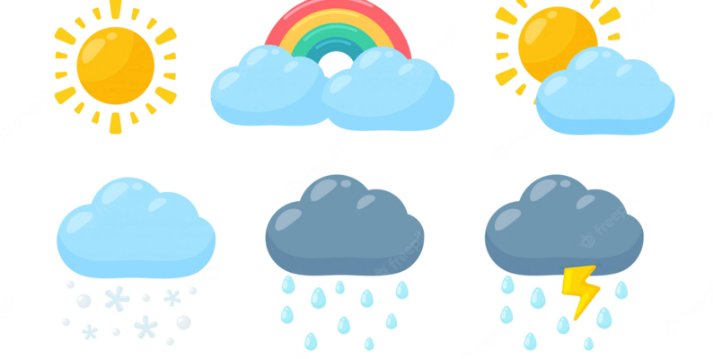

# 🌦️ Weather Classification using Deep Learning

This project builds a **weather classification system** using deep learning models trained on structured time-series weather data. The pipeline includes data preprocessing, feature engineering, multiple neural network architectures, training with early stopping, evaluation using various metrics, and visualization of model performance.



---

## 📁 Dataset

* **Source:** Kaggle dataset `python-project-on-weather-dataset` by `swatikhedekar`
* **Format:** CSV file with weather records
* **Target:** `Weather` (multiclass categorical label)
* **Features:** Time, temperature, humidity, wind speed, visibility, pressure, etc.

---

## 📌 Project Steps

### 1. **Import Dependencies**

* Libraries for data processing (`numpy`, `pandas`), visualization (`matplotlib`, `seaborn`), machine learning (`scikit-learn`), and deep learning (`TensorFlow`, `Keras`).

---

### 2. **Load Dataset**

* Download the dataset using `kagglehub`.
* Read the CSV into a DataFrame using `pandas`.

---

### 3. **Initial Data Exploration**

* Preview with `.head()` / `.tail()`
* Check data types with `.info()`
* Use `.describe()` and `.isna()` to identify missing values.
* Count class distribution of the target variable (`Weather`).

---

### 4. **Target Cleaning**

* Normalize class labels:

  * Remove redundancy (e.g. "Mostly", "Heavy", "Showers")
  * Map similar classes (e.g. "drizzle" → "rain", "haze" → "fog")
* Display class distribution before and after cleaning.

---

### 5. **Handle Imbalanced Classes**

* Drop under-represented classes (`< THRESHOLD_MIN`)
* Downsample over-represented classes (`> THRESHOLD_MAX`)
* Ensures class balance for better generalization.

---

### 6. **Data Visualization**

* **Histograms** for numerical features
* **Count plot** for class balance
* **Line plots** to visualize weather trends over time
* **Box plots** for outlier detection across classes

---

### 7. **Outlier Handling**

* Use **IQR clipping** to cap extreme values (per class)
* Re-plot boxplots to confirm outlier removal

---

### 8. **Feature Engineering**

* Extract features from time:

  * `month`: Integer
  * `day`: Day-in-month as continuous index
  * `year_quarter`: Season (Winter/Spring/Summer/Autumn)
  * `am-!pm`: Binary (Daytime vs Night)
* Append to input features

---

### 9. **Correlation Analysis & Feature Selection**

* Use a **heatmap** to visualize correlation among numerical features
* Perform **ANOVA F-test** (`f_classif`) to score each feature's impact on the target

---

### 10. **Preprocessing for Modeling**

* Drop time column
* One-hot encode `year_quarter`
* Apply **Label Encoding** to the target
* Apply **Standard Scaling** to numerical features

---

### 11. **Train/Test Split**

* Stratified split (`train_test_split`) with `test_size=0.25`
* Ensure balanced representation of classes in both sets

---

### 12. **Modeling (Keras)**

Custom class `CustomModel` wraps Keras models with:

* Saving/loading from cache
* Early stopping & model checkpointing
* Training, prediction, and evaluation functionality
* Training history tracking

---

### 13. **Deep Learning Architectures**

Five models were created with different depth, activations, and skip connections:

| Model    | Layers          | Activations | Skip Connection |
| -------- | --------------- | ----------- | --------------- |
| `deep_1` | 32 → 8          | ReLU        | ❌               |
| `deep_2` | 16              | ReLU        | ❌               |
| `deep_3` | 32 → 16 → 8 + 8 | ReLU + ELU  | ✅               |
| `deep_4` | 32 → 16 → 8 + 8 | ELU         | ✅               |
| `deep_5` | 32 → 16 → 8 + 8 | Tanh + ReLU | ✅               |

---

### 14. **Training & Monitoring**

* All models trained for up to `100` epochs with:

  * `validation_split=0.1`
  * EarlyStopping (patience=5)
  * Save best model per validation loss
* Plots of **accuracy** and **loss** curves are generated per model

---

### 15. **Evaluation**

* Evaluate both training and test sets using:

  * **Accuracy**
  * **Recall (weighted)**
  * **Precision (weighted)**
  * **F1-score (weighted)**
* Save evaluation results into `eval_dataset.csv`

---

### 16. **Visualization**

* **Bar plots** of metrics across models
* **Model architecture diagrams** using `plot_model`
* Save to `models_arch` directory

---

### 17. **Predictions & Outputs**

* Save predictions on train/test data into CSV files
* Store in `models_predictions` folder for analysis

---

### 18. **Cache Artifacts**

Store important components for future inference:

* Trained models (`.keras`)
* Training history (`.pickle`)
* Scaler (`StandardScaler`)
* Label encoder (`LabelEncoder`)

> Saved under `models_cache` and `encoders_scalers`

---

## 📦 Project Structure

```
.
├── Weather Data.csv
├── models_cache/
├── models_predictions/
├── models_arch/
├── encoders_scalers/
├── eval_dataset.csv
└── weather_classification.ipynb
```

---

## 🧠 Dependencies

* Python 3.7+
* `tensorflow`, `keras`
* `pandas`, `numpy`, `matplotlib`, `seaborn`
* `scikit-learn`
* `kagglehub`

---

## 🚀 Future Improvements

* Integrate LSTM or temporal models
* Hyperparameter tuning (e.g., with Keras Tuner or Optuna)
* Add confusion matrices and class-level evaluation
* Deploy best model as an API

---

## 📬 Author

Developed by Youssef Samy | Deep Learning Weather Classification Project
Under academic/learning purposes

> 🔗 [Portfolio](https://yosefsamy0portfolio.netlify.app/)
